# Section05_ObjectOrientedProgrammingPlus - アーキテクチャ詳細

## Clean Architecture 5層構造

### レイヤー依存関係図

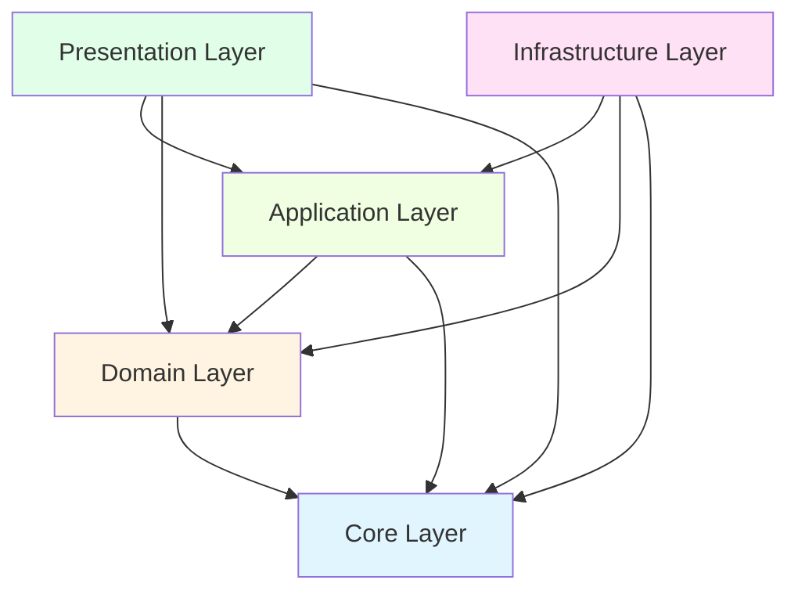

### 依存関係ルール

1. **内側のレイヤーは外側のレイヤーを知らない**
2. **依存の方向は常に内側（Core）に向かう**
3. **インターフェースによる依存性の逆転**

## レイヤー詳細

### 1. Core Layer（最内層）

**責務**: ビジネスルールの基礎となる値オブジェクトと基本型

**特徴**:

- 他のレイヤーに依存しない
- イミュータブル（不変）
- ビジネスロジックを含まない

**コンポーネント**:

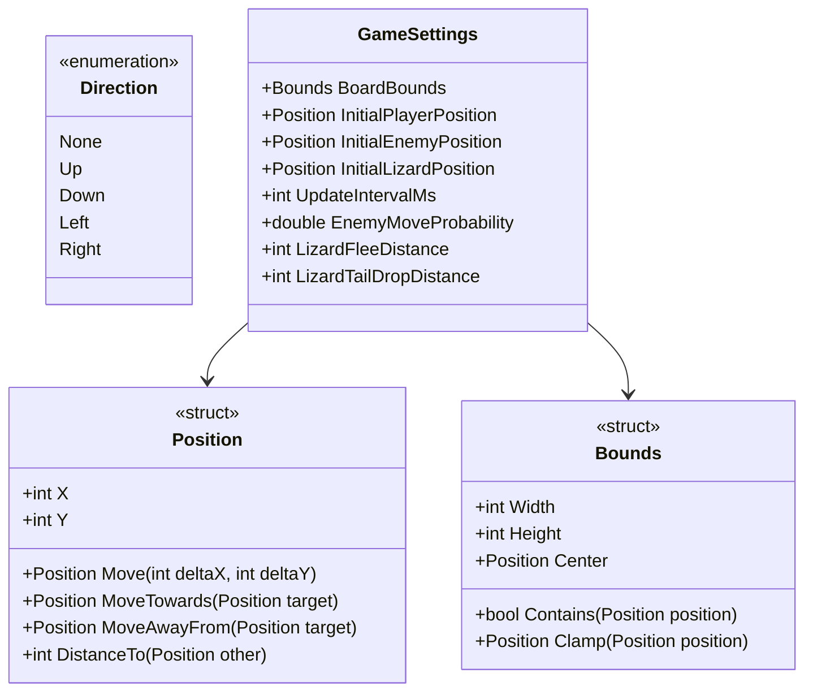

### 2. Domain Layer（ビジネスロジック層）

**責務**: ゲームのビジネスルールとドメインモデル

**特徴**:

- Coreレイヤーのみに依存
- 外部システムを知らない
- ビジネスロジックの中核

**サブレイヤー**:

#### Entities（エンティティ）

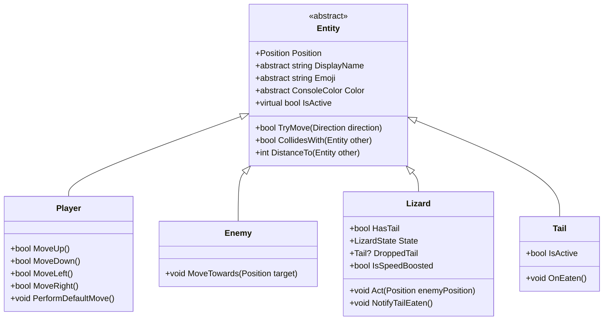

#### Behaviors（振る舞い）

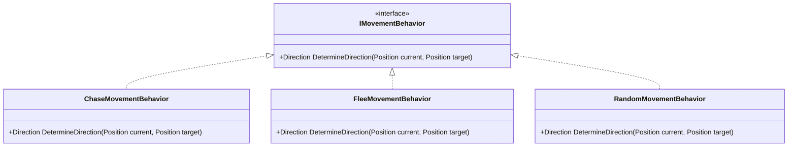

#### GameState（ゲーム状態）

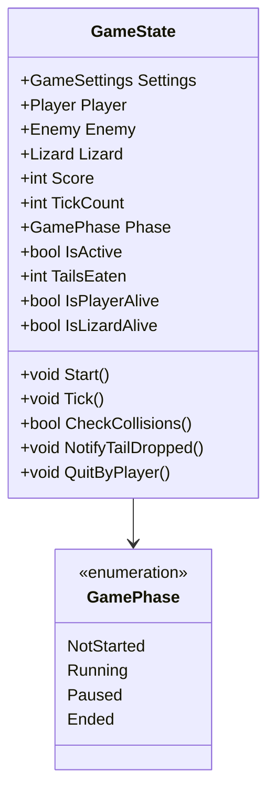

### 3. Application Layer（アプリケーション層）

**責務**: ユースケースの実装とオーケストレーション

**特徴**:

- Domain/Coreレイヤーに依存
- インターフェースで外部システムを抽象化
- ビジネスロジックの調整役

**コンポーネント**:

#### Services

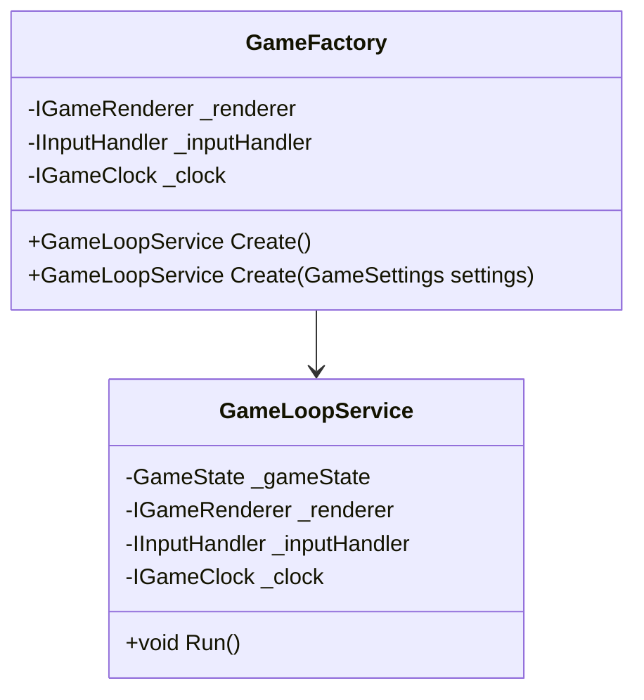

#### Interfaces

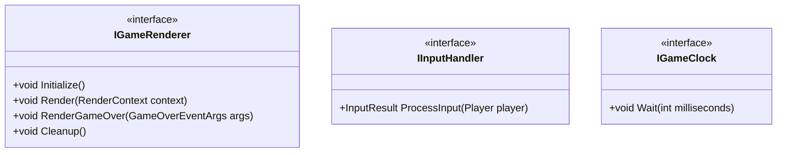

### 4. Infrastructure Layer（インフラストラクチャ層）

**責務**: 外部システムとの接続実装

**特徴**:

- Application/Domain/Coreレイヤーに依存
- インターフェースの具体的な実装
- 外部依存を隠蔽

**コンポーネント**:

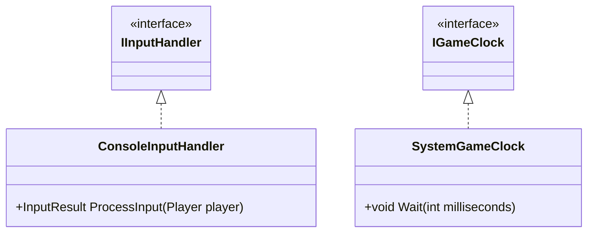

### 5. Presentation Layer（プレゼンテーション層）

**責務**: ユーザーインターフェースの実装

**特徴**:

- すべてのレイヤーに依存可能
- UI固有のロジック
- 表示の詳細を担当

**コンポーネント**:

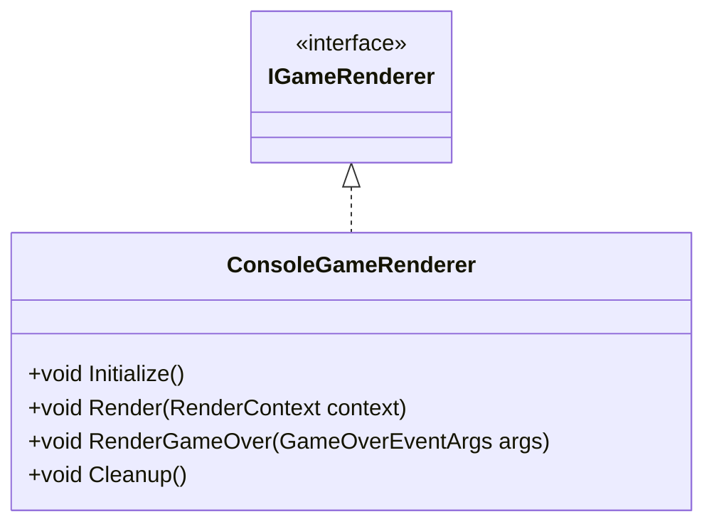

## データフロー図

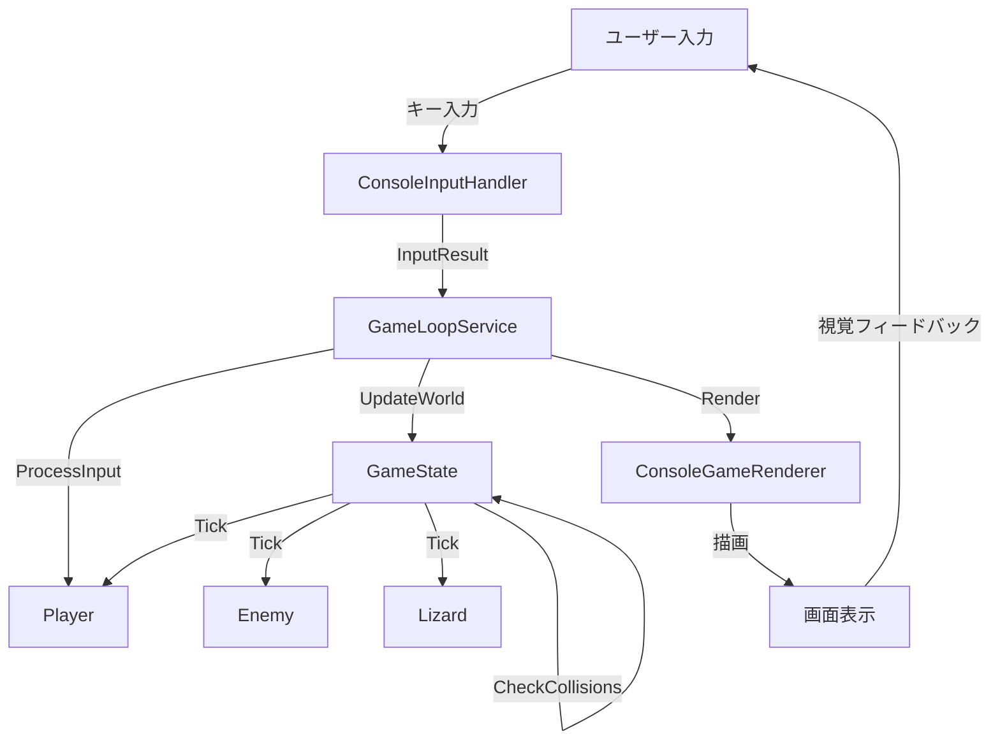

## パッケージ図

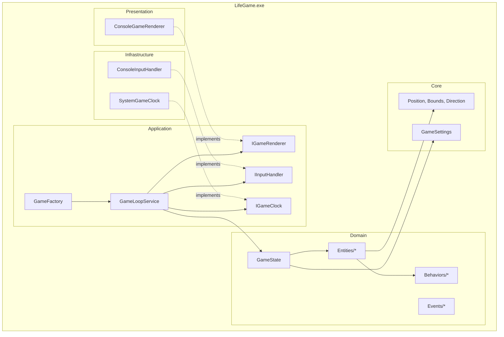

## 依存性注入フロー

```mermaid
sequenceDiagram
    participant Main as Program.Main
    participant Life as LifeGame
    participant Factory as GameFactory
    participant Loop as GameLoopService
    participant State as GameState

    Main->>Life: new LifeGame()
    Life->>Life: new ConsoleGameRenderer()
    Life->>Life: new ConsoleInputHandler()
    Life->>Life: new SystemGameClock()
    Life->>Factory: new GameFactory(renderer, input, clock)
    Factory->>State: new GameState(settings, player, enemy, lizard)
    Factory->>Loop: new GameLoopService(state, renderer, input, clock)
    Factory-->>Life: return GameLoopService
    Life->>Loop: Run()
```
