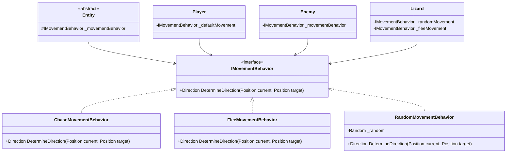
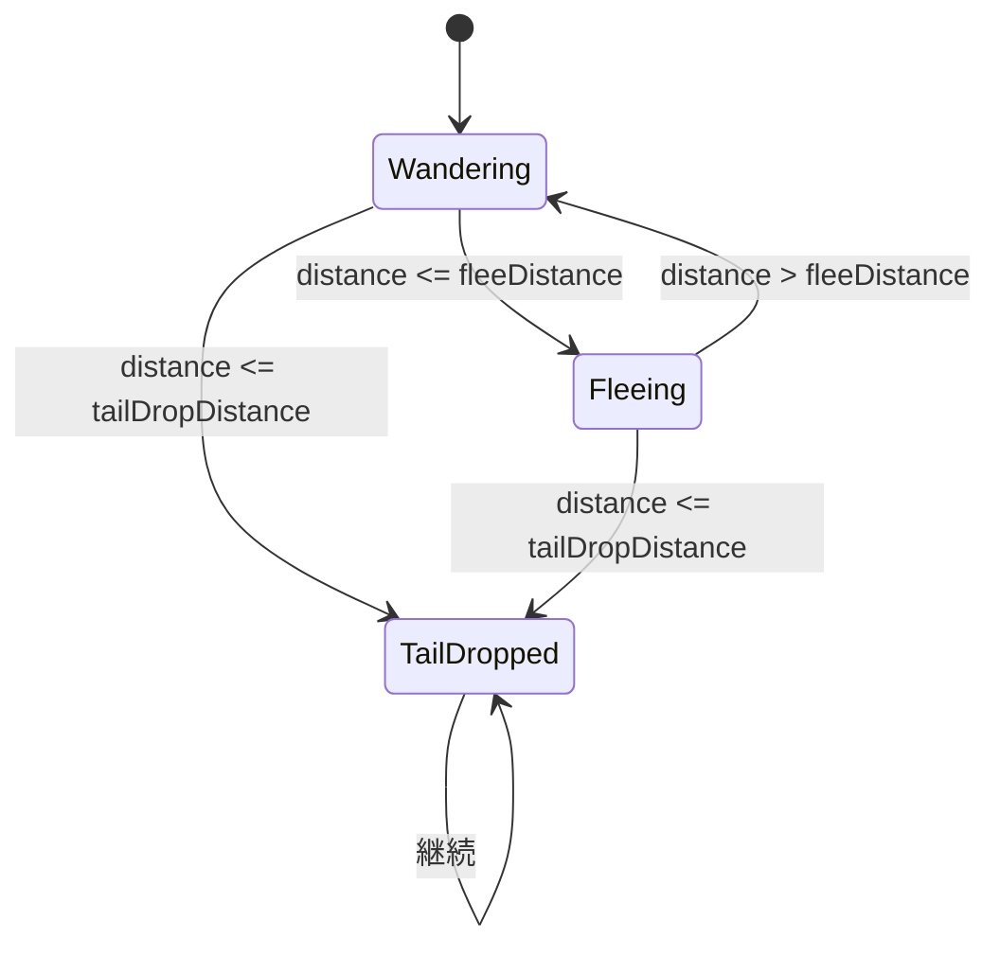
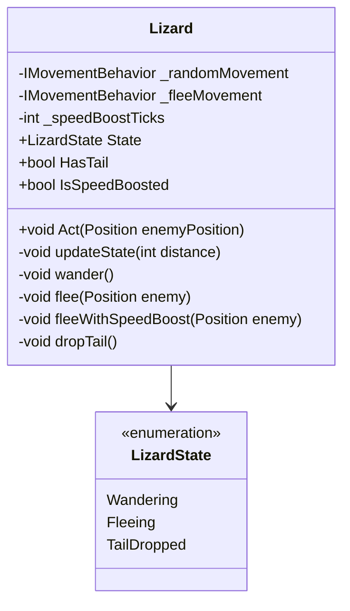
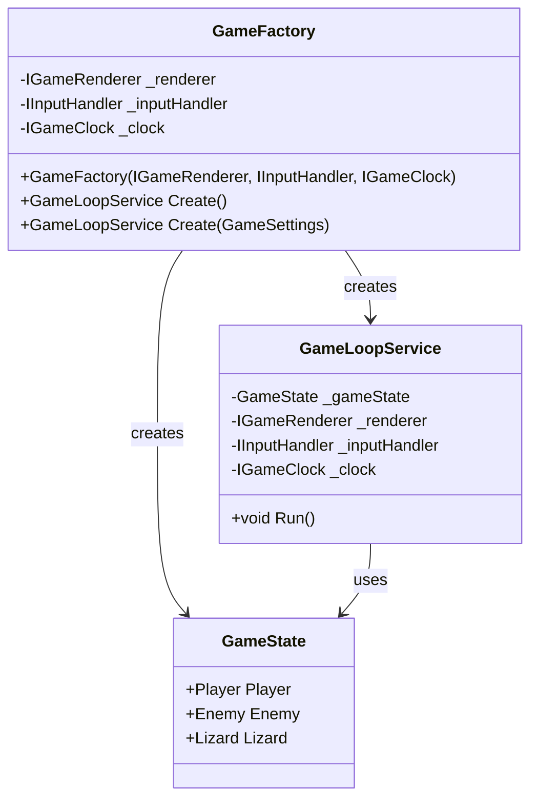
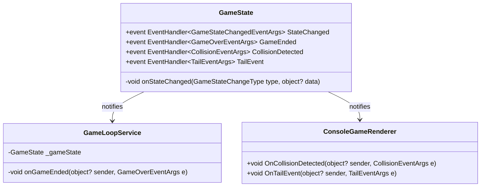
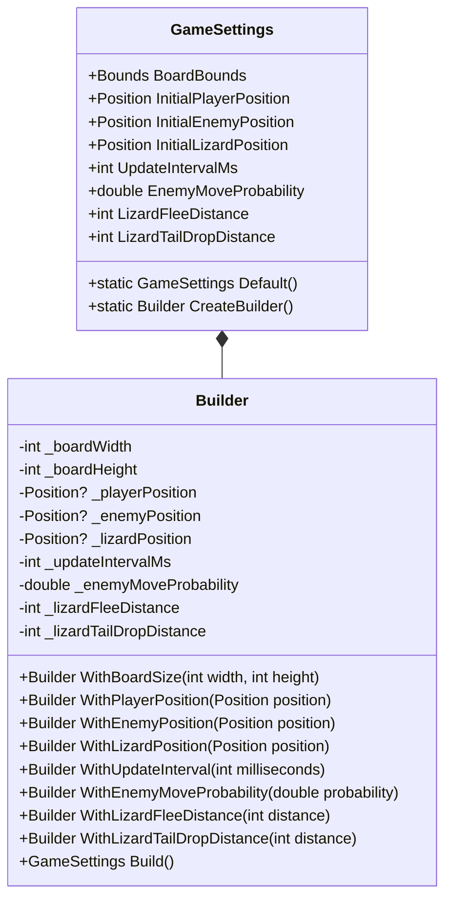
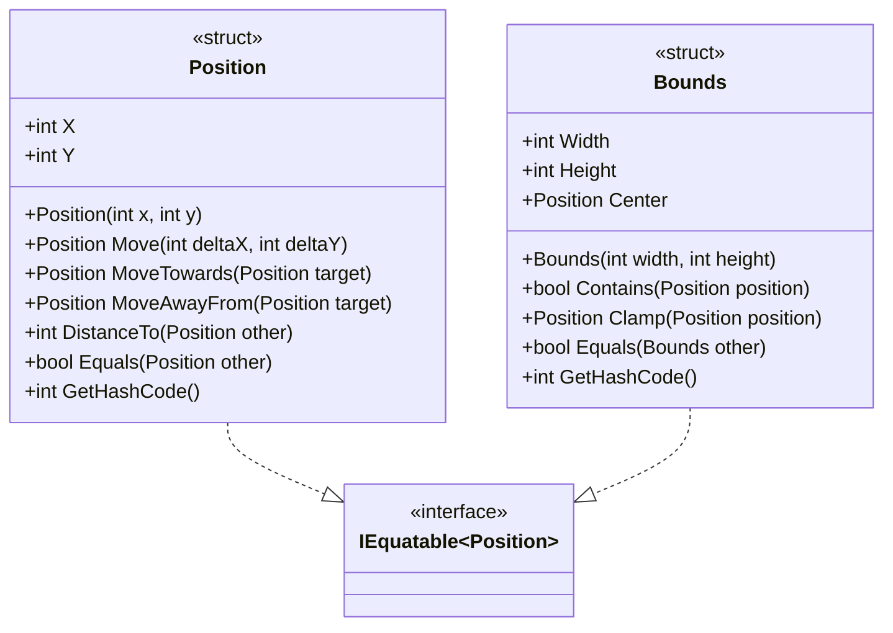
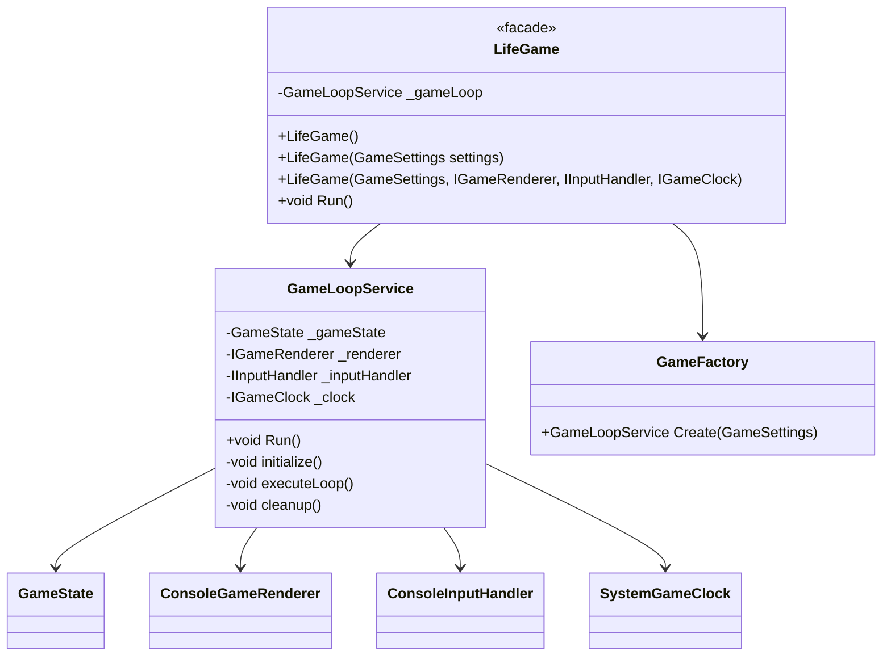
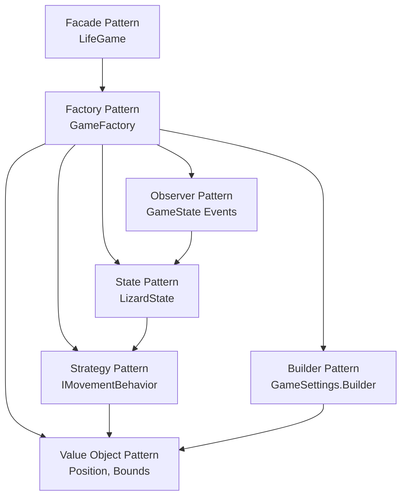

# Section05_ObjectOrientedProgrammingPlus - デザインパターン詳細

## 適用されているデザインパターン一覧

1. [Strategy Pattern（戦略パターン）](#1-strategy-pattern戦略パターン)
2. [State Pattern（ステートパターン）](#2-state-patternステートパターン)
3. [Factory Pattern（ファクトリパターン）](#3-factory-patternファクトリパターン)
4. [Observer Pattern（オブザーバーパターン）](#4-observer-patternオブザーバーパターン)
5. [Builder Pattern（ビルダーパターン）](#5-builder-patternビルダーパターン)
6. [Value Object Pattern（値オブジェクトパターン）](#6-value-object-pattern値オブジェクトパターン)
7. [Facade Pattern（ファサードパターン）](#7-facade-patternファサードパターン)

---

## 1. Strategy Pattern（戦略パターン）

### Strategy: 目的

アルゴリズムをカプセル化し、実行時に切り替え可能にする

### Strategy: 実装箇所

移動行動（IMovementBehavior）

### Strategy: クラス図



### Strategy: コード例

```csharp
// Strategy Interface
public interface IMovementBehavior
{
    Direction DetermineDirection(Position currentPosition, Position targetPosition);
}

// Concrete Strategy 1: Chase
public sealed class ChaseMovementBehavior : IMovementBehavior
{
    public Direction DetermineDirection(Position currentPosition, Position targetPosition)
    {
        var deltaX = targetPosition.X - currentPosition.X;
        var deltaY = targetPosition.Y - currentPosition.Y;

        if (Math.Abs(deltaX) >= Math.Abs(deltaY))
            return deltaX > 0 ? Direction.Right : Direction.Left;
        else
            return deltaY > 0 ? Direction.Down : Direction.Up;
    }
}

// Context
public sealed class Enemy : Entity
{
    private readonly IMovementBehavior _movementBehavior;

    public Enemy(Position initialPosition, Bounds bounds, IMovementBehavior? movementBehavior = null)
        : base(initialPosition, bounds)
    {
        _movementBehavior = movementBehavior ?? new ChaseMovementBehavior();
    }

    public void MoveTowards(Position target)
    {
        var direction = _movementBehavior.DetermineDirection(Position, target);
        TryMove(direction);
    }
}
```

### Strategy: メリット

- 移動アルゴリズムの追加・変更が容易
- テスト時にモック戦略を注入可能
- Open/Closed原則に準拠

---

## 2. State Pattern（ステートパターン）

### State: 目的

オブジェクトの状態に応じて振る舞いを変更する

### State: 実装箇所

トカゲの状態管理（LizardState）

### State: 状態遷移図



### State: クラス図



### State: コード例

```csharp
public enum LizardState
{
    Wandering,      // うろうろ歩く
    Fleeing,        // 逃走中
    TailDropped     // 尻尾を切り離して倍速逃走
}

public sealed class Lizard : Entity
{
    public LizardState State { get; private set; } = LizardState.Wandering;

    public void Act(Position enemyPosition)
    {
        var distanceToEnemy = Position.DistanceTo(enemyPosition);
        updateState(distanceToEnemy);

        // 状態に応じた行動
        switch (State)
        {
            case LizardState.Wandering:
                wander();
                break;
            case LizardState.Fleeing:
                flee(enemyPosition);
                break;
            case LizardState.TailDropped:
                fleeWithSpeedBoost(enemyPosition);
                break;
        }
    }

    private void updateState(int distanceToEnemy)
    {
        switch (State)
        {
            case LizardState.Wandering:
                if (distanceToEnemy <= _tailDropDistance)
                    dropTail();
                else if (distanceToEnemy <= _fleeDistance)
                    State = LizardState.Fleeing;
                break;
            // ... 他の状態遷移
        }
    }
}
```

### State: メリット

- 状態ごとの振る舞いが明確
- 新しい状態の追加が容易
- 状態遷移ロジックの集約

---

## 3. Factory Pattern（ファクトリパターン）

### Factory: 目的

オブジェクト生成の複雑さを隠蔽する

### Factory: 実装箇所

GameFactory

### Factory: クラス図



### Factory: コード例

```csharp
public sealed class GameFactory
{
    private readonly IGameRenderer _renderer;
    private readonly IInputHandler _inputHandler;
    private readonly IGameClock _clock;

    public GameFactory(IGameRenderer renderer, IInputHandler inputHandler, IGameClock clock)
    {
        _renderer = renderer;
        _inputHandler = inputHandler;
        _clock = clock;
    }

    public GameLoopService Create(GameSettings settings)
    {
        // 複雑なオブジェクトグラフの構築
        var player = new Player(settings.InitialPlayerPosition, settings.BoardBounds);
        var enemy = new Enemy(settings.InitialEnemyPosition, settings.BoardBounds);
        var lizard = new Lizard(
            settings.InitialLizardPosition,
            settings.BoardBounds,
            settings.LizardFleeDistance,
            settings.LizardTailDropDistance);

        var gameState = new GameState(settings, player, enemy, lizard);

        return new GameLoopService(gameState, _renderer, _inputHandler, _clock);
    }
}
```

### Factory: メリット

- オブジェクト生成ロジックの集約
- 依存関係の管理が容易
- テスト時の設定変更が簡単

---

## 4. Observer Pattern（オブザーバーパターン）

### Observer: 目的

オブジェクトの状態変化を他のオブジェクトに通知する

### Observer: 実装箇所

GameStateのイベント

### Observer: クラス図



### Observer: コード例

```csharp
// Subject (Publisher)
public sealed class GameState
{
    public event EventHandler<GameStateChangedEventArgs>? StateChanged;
    public event EventHandler<GameOverEventArgs>? GameEnded;
    public event EventHandler<CollisionEventArgs>? CollisionDetected;
    public event EventHandler<TailEventArgs>? TailEvent;

    private void onStateChanged(GameStateChangeType changeType, object? data = null)
    {
        StateChanged?.Invoke(this, new GameStateChangedEventArgs(changeType, data));
    }

    public void Tick()
    {
        TickCount++;
        Score++;
        onStateChanged(GameStateChangeType.ScoreChanged, Score);
    }
}

// Observer (Subscriber)
public sealed class GameLoopService
{
    private void initialize()
    {
        _gameState.GameEnded += onGameEnded;
        _gameState.Start();
    }

    private void onGameEnded(object? sender, GameOverEventArgs e)
    {
        _gameOverArgs = e;
    }
}
```

### Observer: メリット

- 疎結合なコンポーネント間通信
- イベント駆動アーキテクチャの実現
- 複数のサブスクライバーをサポート

---

## 5. Builder Pattern（ビルダーパターン）

### Builder: 目的

複雑なオブジェクトの構築をステップバイステップで行う

### Builder: 実装箇所

GameSettings.Builder

### Builder: クラス図



### Builder: コード例

```csharp
public sealed class GameSettings
{
    public static Builder CreateBuilder() => new();

    public class Builder
    {
        private int _boardWidth = 32;
        private int _boardHeight = 32;
        private Position? _playerPosition;
        // ... 他のフィールド

        public Builder WithBoardSize(int width, int height)
        {
            _boardWidth = width;
            _boardHeight = height;
            return this;
        }

        public Builder WithPlayerPosition(Position position)
        {
            _playerPosition = position;
            return this;
        }

        public GameSettings Build()
        {
            var bounds = new Bounds(_boardWidth, _boardHeight);
            var playerPos = _playerPosition ?? new Position(_boardWidth * 3 / 4, _boardHeight / 2);
            // ... バリデーションと構築

            return new GameSettings(bounds, playerPos, enemyPos, lizardPos, ...);
        }
    }
}

// 使用例
var settings = GameSettings.CreateBuilder()
    .WithBoardSize(40, 40)
    .WithUpdateInterval(100)
    .WithLizardFleeDistance(10)
    .Build();
```

### Builder: メリット

- 流暢なインターフェース（Fluent Interface）
- 複雑な設定の段階的構築
- デフォルト値の提供

---

## 6. Value Object Pattern（値オブジェクトパターン）

### ValueObject: 目的

不変な値を表現し、等価性で比較する

### ValueObject: 実装箇所

Position, Bounds

### ValueObject: クラス図



### ValueObject: コード例

```csharp
public readonly struct Position : IEquatable<Position>
{
    public int X { get; }
    public int Y { get; }

    public Position(int x, int y)
    {
        X = x;
        Y = y;
    }

    // イミュータブル: 新しいインスタンスを返す
    public Position Move(int deltaX, int deltaY) => new(X + deltaX, Y + deltaY);

    // 等価性比較
    public bool Equals(Position other) => X == other.X && Y == other.Y;

    public override bool Equals(object? obj) => obj is Position other && Equals(other);

    public override int GetHashCode() => HashCode.Combine(X, Y);

    public static bool operator ==(Position left, Position right) => left.Equals(right);
    public static bool operator !=(Position left, Position right) => !left.Equals(right);
}
```

### ValueObject: メリット

- スレッドセーフ（不変）
- 値による等価性比較
- メモリ効率的（struct）

---

## 7. Facade Pattern（ファサードパターン）

### Facade: 目的

複雑なサブシステムへの統一されたインターフェースを提供する

### Facade: 実装箇所

LifeGame, GameLoopService

### Facade: クラス図



### Facade: コード例

```csharp
// Facade
public sealed class LifeGame
{
    private readonly GameLoopService _gameLoop;

    // シンプルなコンストラクタ（デフォルト設定）
    public LifeGame() : this(GameSettings.Default())
    {
    }

    // カスタム設定
    public LifeGame(GameSettings settings)
        : this(
            settings,
            new ConsoleGameRenderer(),
            new ConsoleInputHandler(),
            new SystemGameClock())
    {
    }

    // 完全な依存性注入（テスト用）
    public LifeGame(
        GameSettings settings,
        IGameRenderer renderer,
        IInputHandler inputHandler,
        IGameClock clock)
    {
        var factory = new GameFactory(renderer, inputHandler, clock);
        _gameLoop = factory.Create(settings);
    }

    // シンプルなAPI
    public void Run()
    {
        _gameLoop.Run();
    }
}

// 使用例
var game = new LifeGame();  // 複雑さを隠蔽
game.Run();                 // シンプルなAPI
```

### Facade: メリット

- 複雑なサブシステムの隠蔽
- シンプルで使いやすいAPI
- クライアントコードの簡潔化

---

## パターン適用マトリクス

| パターン | 適用箇所 | SOLID原則 | 主な目的 |
| --------- | --------- | ----------- | --------- |
| Strategy | IMovementBehavior | OCP, DIP | アルゴリズムの切り替え |
| State | LizardState | SRP, OCP | 状態依存の振る舞い |
| Factory | GameFactory | SRP, DIP | オブジェクト生成の集約 |
| Observer | GameState Events | OCP, DIP | イベント駆動通信 |
| Builder | GameSettings.Builder | SRP | 複雑なオブジェクト構築 |
| Value Object | Position, Bounds | SRP | 不変な値の表現 |
| Facade | LifeGame | SRP | 複雑さの隠蔽 |

## パターン間の相互作用


