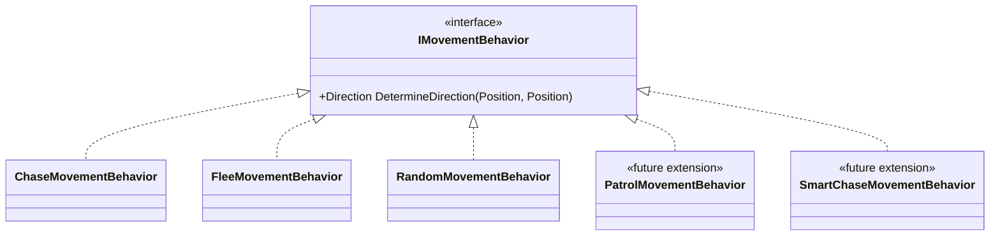
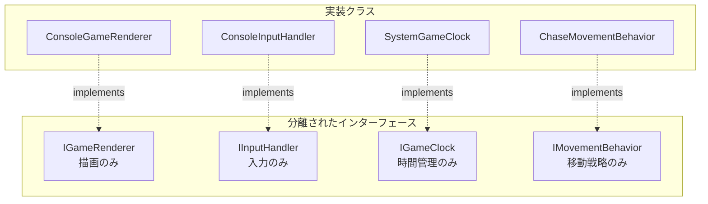
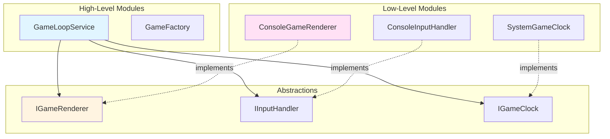
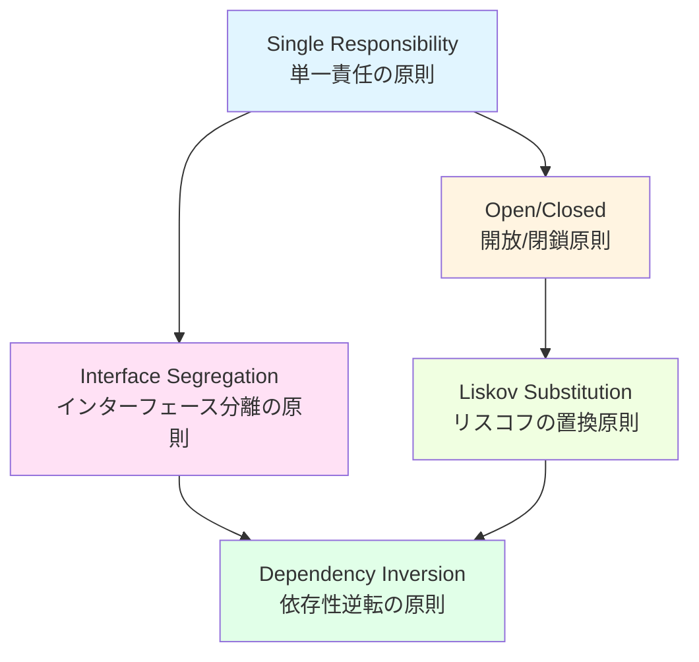

# Section05_ObjectOrientedProgrammingPlus - SOLID原則の適用

## 目次

1. [Single Responsibility Principle (単一責任の原則)](#1-single-responsibility-principle-単一責任の原則)
2. [Open/Closed Principle (開放/閉鎖原則)](#2-openclosed-principle-開放閉鎖原則)
3. [Liskov Substitution Principle (リスコフの置換原則)](#3-liskov-substitution-principle-リスコフの置換原則)
4. [Interface Segregation Principle (インターフェース分離の原則)](#4-interface-segregation-principle-インターフェース分離の原則)
5. [Dependency Inversion Principle (依存性逆転の原則)](#5-dependency-inversion-principle-依存性逆転の原則)

---

## 1. Single Responsibility Principle (単一責任の原則)

### SRP: 定義

クラスは変更する理由を1つだけ持つべきである

### SRP: 適用例

#### ✅ 良い例: 責任が分離されている

```csharp
// 責任: ゲーム状態の管理のみ
public sealed class GameState
{
    public void Start() { /* ゲーム開始ロジック */ }
    public void Tick() { /* ティック処理 */ }
    public bool CheckCollisions() { /* 衝突判定 */ }
}

// 責任: 描画のみ
public sealed class ConsoleGameRenderer : IGameRenderer
{
    public void Render(RenderContext context) { /* 描画ロジック */ }
}

// 責任: 入力処理のみ
public sealed class ConsoleInputHandler : IInputHandler
{
    public InputResult ProcessInput(Player player) { /* 入力処理 */ }
}

// 責任: 時間管理のみ
public sealed class SystemGameClock : IGameClock
{
    public void Wait(int milliseconds) { /* 待機処理 */ }
}
```

#### ❌ 悪い例: 複数の責任を持つ（アンチパターン）

```csharp
// 複数の責任を持つ神クラス
public class GameManager
{
    // ゲーム状態管理
    public void UpdateGameState() { }

    // 描画
    public void RenderScreen() { }

    // 入力処理
    public void HandleInput() { }

    // ファイルI/O
    public void SaveGame() { }
    public void LoadGame() { }

    // ネットワーク通信
    public void SendScore() { }
}
```

### SRP: Section05での適用箇所

| クラス | 単一の責任 |
| ------- | ----------- |
| Position | 位置情報の保持と計算 |
| Bounds | 境界情報の保持と判定 |
| GameSettings | ゲーム設定の保持 |
| Entity | エンティティの基本機能 |
| Player | プレイヤー操作 |
| Enemy | 敵の追跡行動 |
| Lizard | トカゲの逃走行動 |
| GameState | ゲーム状態の管理 |
| GameLoopService | ゲームループの制御 |
| GameFactory | オブジェクト生成 |
| ConsoleGameRenderer | コンソール描画 |
| ConsoleInputHandler | コンソール入力 |
| SystemGameClock | 時間管理 |

### SRP: メリット

- クラスが理解しやすい
- テストが容易
- 変更の影響範囲が限定的
- 再利用性が高い

---

## 2. Open/Closed Principle (開放/閉鎖原則)

### OCP: 定義

ソフトウェアエンティティは拡張に対して開いており、修正に対して閉じているべきである

### OCP: 適用例

#### ✅ 良い例: 拡張可能な設計

```csharp
// インターフェースで抽象化（修正に閉じている）
public interface IMovementBehavior
{
    Direction DetermineDirection(Position current, Position target);
}

// 既存の実装（修正不要）
public sealed class ChaseMovementBehavior : IMovementBehavior
{
    public Direction DetermineDirection(Position current, Position target)
    {
        // 追跡ロジック
    }
}

// 新しい実装を追加（拡張に開いている）
public sealed class FleeMovementBehavior : IMovementBehavior
{
    public Direction DetermineDirection(Position current, Position target)
    {
        // 逃走ロジック
    }
}

// さらに新しい実装を追加可能
public sealed class PatrolMovementBehavior : IMovementBehavior
{
    public Direction DetermineDirection(Position current, Position target)
    {
        // パトロールロジック
    }
}
```

#### ❌ 悪い例: 修正が必要な設計

```csharp
public class Enemy
{
    private MovementType _type;

    public void Move(Position target)
    {
        // 新しい移動タイプを追加するたびに修正が必要
        switch (_type)
        {
            case MovementType.Chase:
                // 追跡ロジック
                break;
            case MovementType.Flee:
                // 逃走ロジック
                break;
            // 新しいケースを追加するたびにこのメソッドを修正
        }
    }
}
```

### Section05での適用箇所

#### 移動戦略の拡張



#### エンティティの拡張

```csharp
// 基底クラス（修正に閉じている）
public abstract class Entity
{
    public abstract string DisplayName { get; }
    public abstract string Emoji { get; }
    public abstract ConsoleColor Color { get; }
}

// 既存のエンティティ
public sealed class Player : Entity { }
public sealed class Enemy : Entity { }
public sealed class Lizard : Entity { }
public sealed class Tail : Entity { }

// 新しいエンティティを追加可能（拡張に開いている）
public sealed class Bird : Entity
{
    public override string DisplayName => "鳥";
    public override string Emoji => "🐦";
    public override ConsoleColor Color => ConsoleColor.Cyan;
}
```

### OCP: メリット

- 既存コードを変更せずに機能追加
- バグの混入リスク低減
- テスト済みコードの保護

---

## 3. Liskov Substitution Principle (リスコフの置換原則)

### LSP: 定義

派生クラスは基底クラスと置き換え可能でなければならない

### LSP: 適用例

#### ✅ 良い例: 置換可能な設計

```csharp
public abstract class Entity
{
    public Position Position { get; private set; }

    // すべての派生クラスで正しく動作する
    public bool TryMove(Direction direction)
    {
        var newPosition = direction.ApplyTo(Position);
        if (!_bounds.Contains(newPosition))
            return false;

        Position = newPosition;
        return true;
    }

    public bool CollidesWith(Entity other) =>
        Position == other.Position;
}

// Player, Enemy, Lizard, Tailすべてが基底クラスとして扱える
public void CheckCollision(Entity entity1, Entity entity2)
{
    if (entity1.CollidesWith(entity2))
    {
        // 衝突処理
    }
}

// 使用例: どのエンティティでも同じように扱える
Entity player = new Player(pos, bounds);
Entity enemy = new Enemy(pos, bounds);
Entity lizard = new Lizard(pos, bounds);

CheckCollision(player, enemy);   // OK
CheckCollision(lizard, enemy);   // OK
CheckCollision(player, lizard);  // OK
```

#### ❌ 悪い例: 置換できない設計

```csharp
public abstract class Entity
{
    public virtual bool TryMove(Direction direction)
    {
        // 基底クラスの実装
        return true;
    }
}

// 基底クラスの契約を破る
public class ImmovableEntity : Entity
{
    public override bool TryMove(Direction direction)
    {
        throw new NotSupportedException("This entity cannot move!");
        // 基底クラスと置き換えられない
    }
}
```

### OCP: Section05での適用箇所

#### エンティティの統一的な扱い

```csharp
public sealed class GameState
{
    public bool CheckCollisions()
    {
        // すべてのエンティティを統一的に扱える
        if (Player.CollidesWith(Enemy))
        {
            // プレイヤーと敵の衝突
        }

        if (Lizard.CollidesWith(Enemy))
        {
            // トカゲと敵の衝突
        }

        var tail = Lizard.DroppedTail;
        if (tail != null && tail.CollidesWith(Enemy))
        {
            // 尻尾と敵の衝突
        }
    }
}
```

#### 移動戦略の統一的な扱い

```csharp
public sealed class Enemy : Entity
{
    private readonly IMovementBehavior _movementBehavior;

    public void MoveTowards(Position target)
    {
        // どの実装でも同じように扱える
        var direction = _movementBehavior.DetermineDirection(Position, target);
        TryMove(direction);
    }
}

// すべての戦略が置換可能
var enemy1 = new Enemy(pos, bounds, new ChaseMovementBehavior());
var enemy2 = new Enemy(pos, bounds, new RandomMovementBehavior());
var enemy3 = new Enemy(pos, bounds, new FleeMovementBehavior());
```

### LSP: メリット

- ポリモーフィズムの正しい活用
- 予測可能な動作
- コードの信頼性向上

---

## 4. Interface Segregation Principle (インターフェース分離の原則)

### ISP: 定義

クライアントは使用しないメソッドへの依存を強制されるべきではない

### ISP: 適用例

#### ✅ 良い例: 小さく分離されたインターフェース

```csharp
// 描画機能のみ
public interface IGameRenderer
{
    void Initialize();
    void Render(RenderContext context);
    void RenderGameOver(GameOverEventArgs args);
    void Cleanup();
}

// 入力処理のみ
public interface IInputHandler
{
    InputResult ProcessInput(Player player);
}

// 時間管理のみ
public interface IGameClock
{
    void Wait(int milliseconds);
}

// 移動戦略のみ
public interface IMovementBehavior
{
    Direction DetermineDirection(Position current, Position target);
}
```

#### ❌ 悪い例: 肥大化したインターフェース

```csharp
// すべての機能を含む巨大なインターフェース
public interface IGameSystem
{
    // 描画
    void Initialize();
    void Render(RenderContext context);
    void RenderGameOver(GameOverEventArgs args);
    void Cleanup();

    // 入力
    InputResult ProcessInput(Player player);

    // 時間管理
    void Wait(int milliseconds);

    // 移動
    Direction DetermineDirection(Position current, Position target);

    // ファイルI/O
    void SaveGame(string path);
    void LoadGame(string path);

    // サウンド
    void PlaySound(string soundName);
    void StopSound();
}

// 実装クラスは使わないメソッドも実装を強制される
public class ConsoleRenderer : IGameSystem
{
    public void Render(RenderContext context) { /* 実装 */ }

    // 使わないメソッドも実装が必要
    public InputResult ProcessInput(Player player) 
        => throw new NotImplementedException();
    public void Wait(int milliseconds) 
        => throw new NotImplementedException();
    // ...
}
```

### ISP: Section05での適用箇所

#### インターフェースの分離



#### GameLoopServiceの依存関係

```csharp
public sealed class GameLoopService
{
    // 必要な機能だけを依存
    private readonly IGameRenderer _renderer;      // 描画のみ
    private readonly IInputHandler _inputHandler;  // 入力のみ
    private readonly IGameClock _clock;            // 時間管理のみ

    public GameLoopService(
        GameState gameState,
        IGameRenderer renderer,
        IInputHandler inputHandler,
        IGameClock clock)
    {
        _gameState = gameState;
        _renderer = renderer;
        _inputHandler = inputHandler;
        _clock = clock;
    }
}
```

### ISP: メリット

- 実装クラスの負担軽減
- テストが容易
- 変更の影響範囲が限定的
- 明確な責任分離

---

## 5. Dependency Inversion Principle (依存性逆転の原則)

### DIP: 定義

高レベルモジュールは低レベルモジュールに依存すべきではない。両方とも抽象に依存すべきである

### DIP: 適用例

#### ✅ 良い例: 抽象に依存

```csharp
// 高レベルモジュール
public sealed class GameLoopService
{
    // 具象クラスではなく抽象（インターフェース）に依存
    private readonly IGameRenderer _renderer;
    private readonly IInputHandler _inputHandler;
    private readonly IGameClock _clock;

    public GameLoopService(
        GameState gameState,
        IGameRenderer renderer,      // 抽象に依存
        IInputHandler inputHandler,  // 抽象に依存
        IGameClock clock)            // 抽象に依存
    {
        _gameState = gameState;
        _renderer = renderer;
        _inputHandler = inputHandler;
        _clock = clock;
    }

    public void Run()
    {
        _renderer.Initialize();
        // ...
    }
}

// 低レベルモジュール（実装）
public sealed class ConsoleGameRenderer : IGameRenderer
{
    public void Initialize() { /* 実装 */ }
    // ...
}
```

#### ❌ 悪い例: 具象クラスに依存

```csharp
// 高レベルモジュール
public sealed class GameLoopService
{
    // 具象クラスに直接依存（悪い）
    private readonly ConsoleGameRenderer _renderer;
    private readonly ConsoleInputHandler _inputHandler;
    private readonly SystemGameClock _clock;

    public GameLoopService(GameState gameState)
    {
        _gameState = gameState;
        // 具象クラスを直接生成（テスト不可能）
        _renderer = new ConsoleGameRenderer();
        _inputHandler = new ConsoleInputHandler();
        _clock = new SystemGameClock();
    }
}
```

### DIP: Section05での適用箇所

#### 依存関係の逆転



#### 依存性注入の実装

```csharp
// エントリーポイント（Composition Root）
public sealed class LifeGame
{
    private readonly GameLoopService _gameLoop;

    // デフォルトコンストラクタ
    public LifeGame() : this(GameSettings.Default())
    {
    }

    // カスタム設定
    public LifeGame(GameSettings settings)
        : this(
            settings,
            new ConsoleGameRenderer(),  // 具象クラスの生成はここだけ
            new ConsoleInputHandler(),
            new SystemGameClock())
    {
    }

    // 完全な依存性注入（テスト用）
    public LifeGame(
        GameSettings settings,
        IGameRenderer renderer,      // 抽象を受け取る
        IInputHandler inputHandler,
        IGameClock clock)
    {
        var factory = new GameFactory(renderer, inputHandler, clock);
        _gameLoop = factory.Create(settings);
    }
}
```

#### テスト時のモック注入

```csharp
// テストコード
[Test]
public void GameLoop_ShouldRenderCorrectly()
{
    // モックの作成
    var mockRenderer = new MockRenderer();
    var mockInput = new MockInputHandler();
    var mockClock = new MockGameClock();

    var settings = GameSettings.Default();

    // モックを注入
    var game = new LifeGame(settings, mockRenderer, mockInput, mockClock);
    game.Run();

    // モックの検証
    Assert.That(mockRenderer.InitializeCalled, Is.True);
    Assert.That(mockRenderer.RenderCallCount, Is.GreaterThan(0));
}
```

### DIP: メリット

- テスタビリティの向上
- 実装の切り替えが容易
- モジュール間の疎結合
- 並行開発が可能

---

## SOLID原則の相互関係



## SOLID原則適用マトリクス

| 原則 | 主な適用箇所 | 実現手段 | メリット |
| ----- | ------------ | --------- | --------- |
| **SRP** | 全クラス | クラスの責任を1つに限定 | 理解しやすさ、テスト容易性 |
| **OCP** | IMovementBehavior, Entity | インターフェース、継承 | 拡張性、既存コードの保護 |
| **LSP** | Entity派生クラス | 契約の遵守 | ポリモーフィズムの正しい活用 |
| **ISP** | Application Interfaces | 小さなインターフェース | 実装の負担軽減 |
| **DIP** | GameLoopService | 依存性注入 | テスタビリティ、疎結合 |

## まとめ

Section05では、SOLID原則を完全に適用することで:

1. 保守性の向上: 各クラスの責任が明確で変更が容易
2. 拡張性の確保: 新機能の追加が既存コードに影響しない
3. テスタビリティ: モックを注入してユニットテストが可能
4. 再利用性: 疎結合なコンポーネントは他のプロジェクトでも利用可能
5. 可読性: 明確な責任分離により理解しやすいコード

これらの原則は相互に補完し合い、Clean Architectureと組み合わせることで、
高品質で保守性の高いソフトウェアを実現しています。
